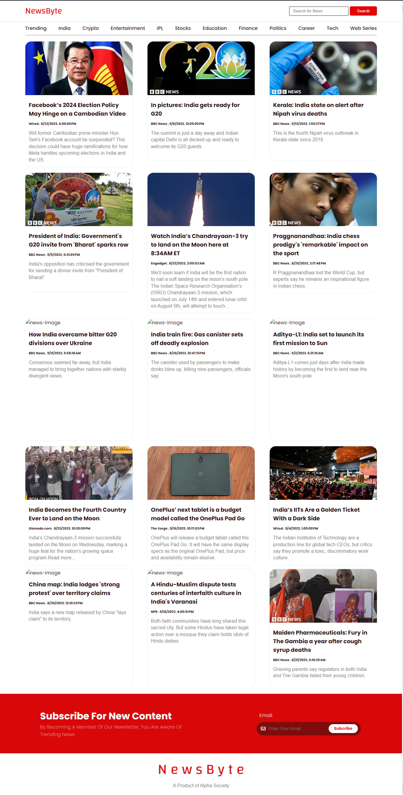

# NewsByte - Simplify Your News Consumption

NewsByte is a lightweight and user-friendly news website that allows you to stay informed about the latest news from various sources. It's built with HTML, CSS, and JavaScript and utilizes the TheNewsAPI (https://thenewsapi.com) to fetch real-time news data.



## Features

- Minimalist and intuitive design for easy news consumption.
- Real-time news updates from multiple sources.
- Responsive layout for a seamless browsing experience on various devices.
- Easy-to-use and navigate.

## Getting Started

To run newsBite locally, follow these simple steps:

1. Clone the repository to your local system:
   ```bash
   https://github.com/Shoyabk1707/NewsByte.git
2. Navigate to the project directory: cd newsBite
3. Ensure you have an active internet connection, as newsBite relies on real-time data from NewsAPI.
4. Open the index.html file in your preferred web browser.

## Dependencies
TheNewsAPI (https://thenewsapi.com) - The API used to fetch news data.

## Contributing
Contributions are welcome! If you'd like to contribute to NewsByte, please follow these steps:

## Fork the repository.
1. Create a new branch for your feature or bug fix: git checkout -b feature/your-feature-name.
2. Make your changes and commit them: git commit -m 'Add a new feature'.
3. Push to the branch: git push origin feature/your-feature-name.
4. Create a pull request to merge your changes into the main branch.

## License
This project is licensed under the MIT License - see the LICENSE file for details.

## Acknowledgments
TheNewsAPI for providing real-time news data.

## Contact
If you have any questions or suggestions, feel free to reach out to us at [email](`shoyabmansuri916@gmail.com`).
